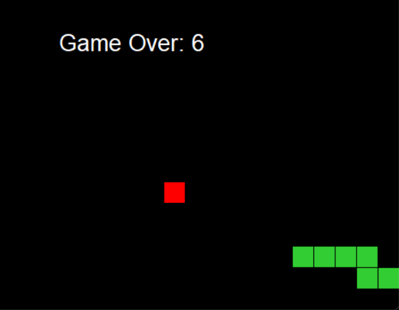
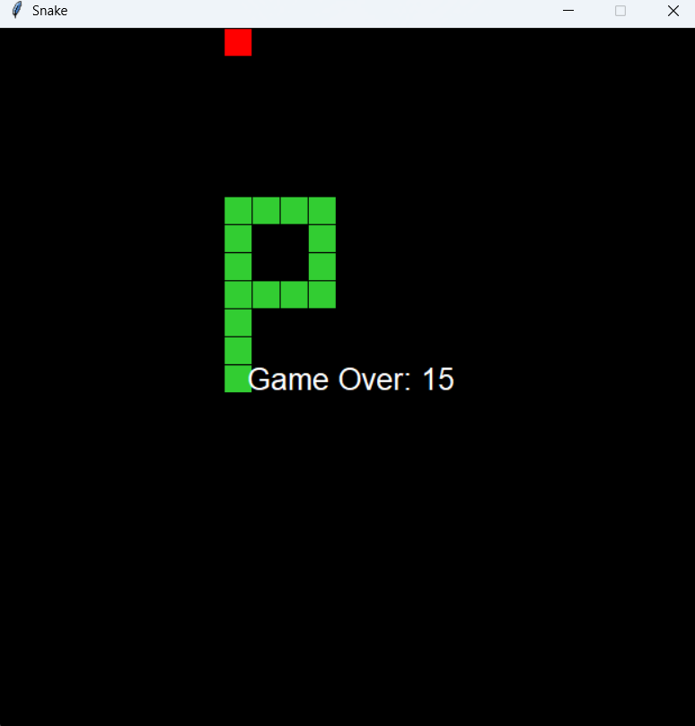

# Snake Game

A simple **Snake Game** built using Python's `tkinter` library. In this game, you control a snake that grows longer by eating food while avoiding collisions with itself and the game boundaries.

---

## Features
- Responsive and smooth gameplay.
- Simple controls: Use arrow keys to move the snake (**Up**, **Down**, **Left**, **Right**).
- Score tracking.
- Game over display when the snake collides with the boundaries or itself.
- Minimalistic graphical interface using `tkinter`.

---

## How to Run
1. Make sure Python 3.x is installed on your system.
2. Clone this repository or download the script.
3. Install any missing dependencies (if any) using:
    ```bash
    pip install tkinter
    ```
4. Run the script:
    ```bash
    python Snake_Game.py
    ```

---

## Controls
- **Arrow Keys**: Control the movement of the snake.
  - `Up Arrow`: Move up.
  - `Down Arrow`: Move down.
  - `Left Arrow`: Move left.
  - `Right Arrow`: Move right.

---

## Game Rules
- The snake moves continuously in the chosen direction.
- The game ends when:
  - The snake collides with the screen boundaries.
  - The snake collides with itself.
- Each time the snake eats the food:
  - The score increases by 1.
  - The snake grows longer.

---

## File Structure
```
.
├── snake_game.py   # Main game script
├── README.md       # Documentation (this file)
```

---

## Screenshots



---

## Video
[Gameplay Video](v1.mp4)

---

## Contributing
Feel free to submit issues or pull requests if you find bugs or want to contribute to the project.

---

## Author
**Sitender Narwal**

